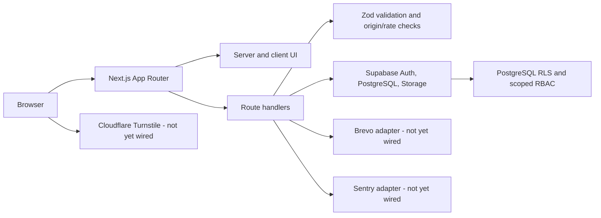

# Architecture

## Purpose and current state

SESC is a Next.js App Router platform for public supporter content, membership, chapter operations, and authorised administration. The repository establishes the UI, validation, security model, and Supabase migrations needed for that platform.

The public site is usable as a development preview. Membership and newsletter endpoints deliberately reject submissions before reading a request body, so the preview cannot persist applications, accept files, collect payment or identity evidence, activate memberships, or subscribe email addresses. The `/member`, `/executive`, and `/admin` routes are also development-safe previews, not live operational portals. Do not process real personal data until the missing integrations are complete and tested.

## System overview

## Application layers

| Layer | Location | Responsibility |
| --- | --- | --- |
| Routes and layouts | `src/app/` | Public pages, portal preview routes, metadata, errors, and API handlers. |
| Reusable interface | `src/components/` | Site chrome, navigation, content patterns, membership-availability notice, and dashboard shells. |
| Domain helpers | `src/lib/` | Membership validation, presentation-only permission helpers, Supabase clients, and utilities. |
| Public development content | `src/data/site-content.ts` | Typed, reviewable placeholder/approved initial content until CMS persistence exists. |
| Data security | `supabase/migrations/` | Profiles, roles, scopes, applications, payments, memberships, notifications, audit records, triggers, and RLS. |
| Test harnesses | `src/**/*.test.*`, `e2e/` | Unit validation and browser smoke coverage. |

## Trust boundaries

### Browser

Only public Supabase URL and anonymous key may reach browser code. Browser-side role helpers, disabled controls, or hidden navigation never establish permission. User-supplied data is untrusted even if client validation has run.

### Next.js server

Route handlers and server actions must validate request data, authenticate the user, check the relevant permission and scope, and return safe errors. The membership handler currently rejects requests before body parsing; it must not be enabled until its authenticated persistence, private upload, review, and retention workflow is complete.

### Supabase

Supabase Auth represents identity. PostgreSQL roles, `user_roles`, `access_scopes`, and `has_permission()` define authorisation. RLS is the final data boundary. A service-role key bypasses RLS and may be used only in server-only modules after an explicit application-level permission check.

### Storage

Identity documents and payment receipts belong in private buckets and UUID-prefixed paths. A server endpoint should validate file size, MIME type, ownership, and authorisation before issuing short-lived signed URLs. Public buckets must never contain member evidence.

## Request flows

### Public content

Public routes render typed content from `src/data/site-content.ts` today. A future CMS must preserve draft/review/published states, metadata, revisions, author attribution, and audit history before replacing this source.

### Membership application (target flow)

1. The browser validates for usability; the server validates the same payload.
2. The server requires a session, anti-abuse controls, and a safe chapter/category selection.
3. A draft/application and private upload metadata are created in Supabase.
4. A payment record is submitted for manual bank-transfer review.
5. Scoped finance and membership officers review only permitted records.
6. An approved payment can lead to membership issuance; database triggers and RLS enforce the transitions.
7. The public verifier exposes only safe active-card information.

The migrations implement the data model and guardrails for this flow; the application routes and authenticated review UI still need to be connected to it.

## Identity and roles

The schema supports multiple grants per user at global, national, or chapter scope. The core role families include visitor/applicant/member; chapter leadership; national executives; operational officers; auditors; and super-administrators. See [RBAC](RBAC.md) and [RLS policies](RLS_POLICIES.md).

The first `super_administrator` is deliberately not self-assignable. Bootstrap it through a controlled Supabase Dashboard or server operation, document who performed it, and verify the resulting audit record.

## External integrations and required configuration

| Integration | Required for | Current repository state |
| --- | --- | --- |
| Supabase | Authenticated features, persistence, RLS, Storage | Schema and helpers exist; production project/configuration is still required. |
| Brevo | Email delivery | API key is represented in `docs/environment.example`; no delivery adapter is implemented. |
| Cloudflare Turnstile | Public-form bot protection | Variables are represented; server verification is not implemented. |
| Sentry | Error monitoring | Variables are represented; SDK/configuration is not implemented. |
| Paystack | Optional electronic payments | Variables are represented; adapter is intentionally disabled/not implemented. |
| Hosting/DNS | Public deployment | No provider-specific deployment adapter is committed. |

## Non-negotiable design rules

- Keep privileged keys server-only and outside Git.
- Apply new migrations; never alter production history in place.
- Retain RLS and policy tests for both permitted and forbidden actions.
- Avoid using development content as real club news, contacts, leadership data, legal terms, or event arrangements.
- Add observability without recording identity documents, payment evidence, access tokens, or unnecessary personal data.

## Related documents

- [Database](DATABASE.md)
- [RBAC](RBAC.md)
- [RLS policies](RLS_POLICIES.md)
- [Deployment](DEPLOYMENT.md)
- [Testing](TESTING.md)
